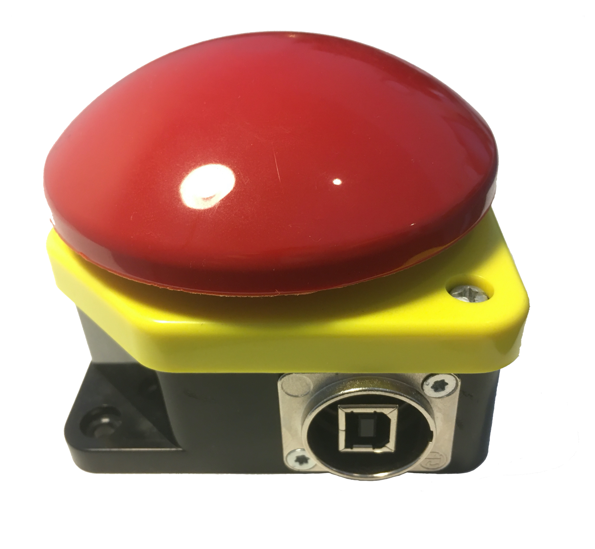
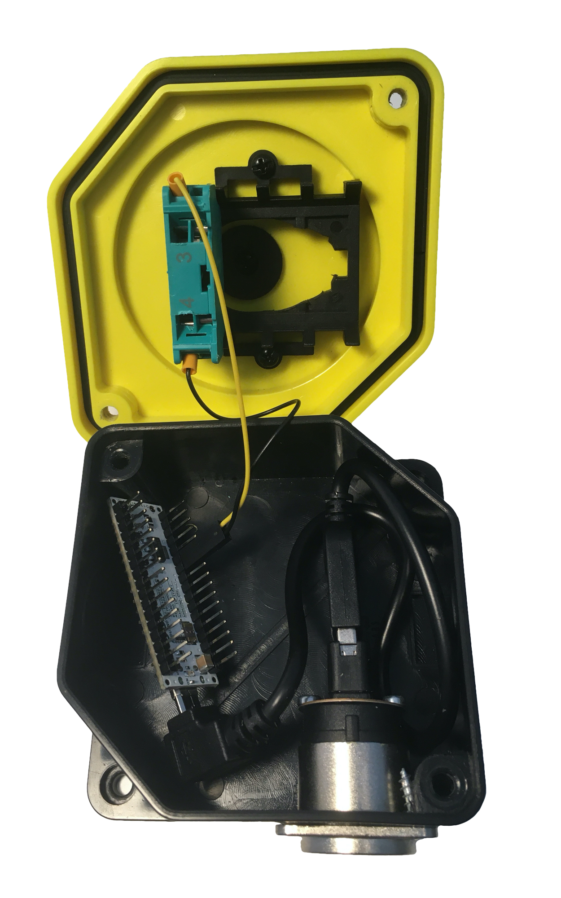

# Push-to-Talk-Button

This is a small project that I built to make video calls a bit more fun in times of COVID-19. Typically, with video calls - especially in larger groups - it is polite to mute yourself unless you want to speak. As with all longer meetings there might be documents that you have to look at in parallel. When you suddently have to talk yourself, you have to find the correct application or browser tab/window to unmute yourself.

The Push-to-Talk-Button is the alternative. Just keep it pushed to unmute yourself and get muted when you release it again. And if you have more to say you can _"double click"_ the button to switch between being permanently muted to being permanently unmuted (and vice versa).

**Beware:** The double click feature only works after you have used the push-to-talk mute/unmute actions once. This calibrates the alternation feature. If you want to use the alternation feature without prior calibration you can uncomment the line `#define SCRIPTED_ALTERNATE_MODE` in the sketch code before flashing it onto the Arduino which activates an additional key combination that you can react on externally to implement the alternation feature.

## Assembly

This is one possible way to build your own Push-to-Talk-Button.

### Parts

* [Arduino Micro](https://www.amazon.de/dp/B00AFY2S56/)
* [Giovenzana Push Button](https://www.amazon.de/gp/product/B014J65KPK/)
* [Neutrik Reversible USB Adapter](https://www.amazon.de/gp/product/B003L79T06/)
* [System-S Micro USB Cable](https://www.amazon.de/gp/product/B01MSB27QE/)
* [AmazonBasic USB A to USB B Cable](https://www.amazon.de/dp/B00NH11KIK/)

### Build

1. Unscrew the plug of the Neutrik Reversible USB Adapter and switch it around so that the USB B connector sits on the metallic outside of the adapter and the USB A connector on the inside.

2. Drill a hole into the base of the Giovenzana Push Button that is fitting to slide the Neutrik Reversible USB Adapter into the base and secure it with the screws. It is best to drill that hole on the right corner of one of the sides.

3. In the top of the Giovenzana Push Button replace the red _"normally closed"_ contact block [PL004001](https://www.giovenzana.com/component/pl004001/) with the green _"normally open"_ contact block [PL004002](https://www.giovenzana.com/component/pl004002/).

4. Clip or desolder the pins of the ICSP header of the Arduino Micro to make it fit better into the Giovenzana Push Button.

5. Connect one side of the Giovenzana Push Button with a **ground pin** of the Arduino Micro and connect the other side of the Giovenzana Push Button with **pin 2** of the Arduino Micro.

6. Use the System-S Micro USB Cable to connect the micro USB connector of the Arduino Micro with the USB A connector of the Neutrik Reversible USB Adapter.

7. Try to fit all connected parts into the base of the Giovenzana Push Button, put its top on the base and make sure that you don't break any cables or cable connections. Screw the top onto the base.

8. Connect the Push-to-Talk-Button to your computer with the help of the AmazonBasic USB A to USB B Cable.

9. Open the Arduino sketch _"push-to-talk-button.ino"_ with the Arduino IDE, import the Keyboard library from _"keyboard.zip"_ library or from [Github](https://github.com/arduino-libraries/Keyboard) and flash the Arduino sketch onto the device.

## Installation

The Push-to-Talk button sends the key combination `SHIFT CTRL CMD M` when muting the computer and the key combination `SHIFT CTRL CMD U` when unmuting the computer.

**Optional:** When using the `SCRIPTED_ALTERNATE_MODE` the Push-To-Talk button sends the additional key combination `SHIFT CTRL CMD A` when using the double click alternation feature. Otherwise, it alternates between mute and unmute after an initial use of the push-to-talk mute/unmute actions for calibration.

### Debian

To react to the key combinations you can do the following:

1. Create a custom keyboard shortcut named `MUTE` with command `amixer set Capture nocap` and shortcut `SHIFT CTRL SUPER M`.
  
2. Create a custom keyboard shortcut named `UNMUTE` with command `amixer set Capture cap` and shortcut `SHIFT CTRL SUPER U`.

### macOS

To react to the key combinations you can do the following:

1. Install [iCanHazShortcut](https://github.com/deseven/icanhazshortcut), e.g. via Homebrew `brew install --cask icanhazshortcut`.

2. Start iCanHazShortcut and go to the Shortcuts tab of the Preferences window.

3. Create a shortcut named `MUTE` with command `osascript -e "set volume input volume 0"` and shortcut `SHIFT CTRL CMD M`.

4. Create a shortcut named `UNMUTE` with command `osascript -e "set volume input volume 75"` and shortcut `SHIFT CTRL CMD U`.

5. **OPTIONAL:** Uncomment the line `#define SCRIPTED_ALTERNATE_MODE` in the sketch code before flashing it onto the Arduino.

6. **OPTIONAL:** Create a shortcut named `ALTERNATE` with command `./macos.sh` and shortcut `SHIFT CTRL CMD A`.